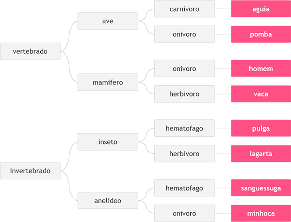

# Desafios DIO - Banco Pan Java Developer

## Intermediário

### Desafio Animal

Neste problema, você deverá ler 3 palavras que definem o tipo de animal possível segundo o esquema abaixo, da esquerda para a direita.  Em seguida conclua qual dos animais seguintes foi escolhido, através das três palavras fornecidas.

### Entrada

A entrada contém 3 palavras, uma em cada linha, necessárias para identificar o animal segundo a figura acima, com todas as letras minúsculas.

### Saída

Imprima o nome do animal correspondente à entrada fornecida.

### Exemplo 1

| Entrada                             | Saída |
|-------------------------------------|-------|
| vertebrado mamifero onivoro | homem |

### Exemplo 2

| Entrada                          | Saída |
|----------------------------------|-------|
| vertebrado ave carnivoro | aguia |

### Exemplo 3

| Entrada                               | Saída   |
|---------------------------------------|---------|
| invertebrado anelideo onivoro | minhoca |

